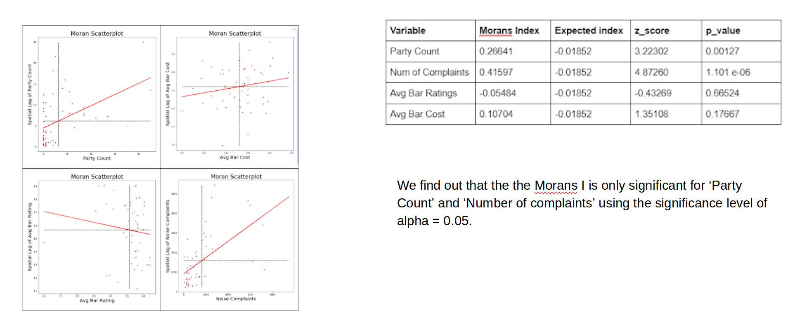

# Spatial-Analysis-of-NYC-Nightlife

## Data Preparation
The data we chose to study for this spatial analysis project consists of these four main sources for our dataset. 

##### Night Activity Spot Identification
We decided to start with the 311 New York City Noise Complaint dataset from 2016. Originally sourced from the NYC Open Data portal (https://opendata.cityofnewyork.us/), we used the 311 noise complaint dataset for calls under the complaint type ‘Loud/Party’ in the year 2016. We filtered this data by time of the day, retaining only the complaints made during the night. Following that we filtered by ‘location type’ to retain only the complaints made about bars, clubs and restaurant. Then we obtained the aggregated data by unique geo locations to get the number of calls made per the inferred club/bar/restaurant locations. We are going to refer to these locations as Night Activity Spots in the following text for simplicity.

##### Night Activity Spot Parameterization 
For this step we used the yelp business entities dataset. Yelp exposes a developers api which can be used to search for the registered business entities and related user review information by geolocation. Business search can be filtered by categories. We decided to obtain the data about the business that fall under the nightlife category and merge this with the Night Activity Spots that we inferred in the first phase. Since each API call returns only the limited number of results (50) we called the API for the centroid of all Public Use Microdata Area (PUMA) regions. We pulled the PUMA shapefile from NYC data portal, extracted the centroids and used the YELP api to get nightlife business locations and attributes. We observed that the geolocation of the Yelp business entities did not perfectly coincide with out Night Activity Spots so a fruitful spatial join was not possible. 
To tackle this problem we devised the following approach. We called the Yelp Api for geolocation of each of our night activity spots. Using api call configuration parameters we sorted the result by proximity and limited search results to top one value. Thus, we were able to pull out a business entity closest to each night activity spot. Therefore, we managed  to obtain following information for each of the night activity spot:
- User rating
- Cost (on scale of 1 to 3)
- Number of user reviews 

##### Yelp Nightlife Events 
Yelp developers API also provides a resource to search for events according to geolocation. We searched for the Yelp events filtered by nightlife category for New York City. We collected the events dataset for the year of 2016, containing following information about the events:
- Geo-location
- Price Category of Yelp’s definition
- Number of attendants (RVSP count)
Night activity spots and nightlife events comprised our points dataset.

##### Spatial Aggregation of Data
Next, we performed spatial aggregation of the the points dataset by PUMA boundaries. This was done in python using spatial join and following aggregation by Puma codes. This resulted in following information for each PUMA:
Number of parties (yelp events)
Average night activity spot rating
Average night activity cost

##### Socioeconomic and Demographic parameterization of Aggregated Data
Aggregating by PUMAs allowed us to look for other interesting data points that could be studies in relation with the night life activity to reveal the relationships. For each PUMA we obtained following information and merged it into the dataset:
- Population
- Total households
- College students
- Immigrants
- High school students
- Un-unemployed persons
- Average house income

## Results

### Team
Urwa Muaz, Tanya Nabila
